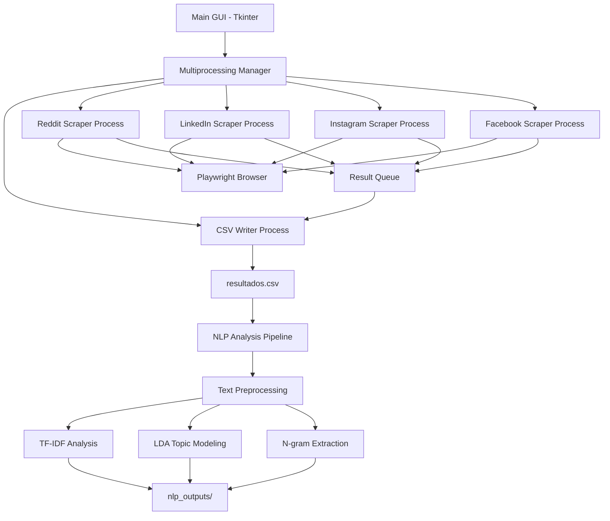

# 🌐 Social Data Harvester: Large-Scale Data Extraction from Social Networks

[](https://www.python.org/downloads/)
[](https://opensource.org/licenses/MIT)
[](https://playwright.dev/)

> **Academic Research Tool**: Automated multi-platform social media scraper with parallel processing and NLP analysis capabilities.

## 📋 Table of Contents

- [Overview](#overview)
- [Features](#features)
- [Architecture](#architecture)
- [Supported Platforms](#supported-platforms)
- [Installation](#installation)
- [Usage](#usage)
- [Project Structure](#project-structure)
- [Data Pipeline](#data-pipeline)
- [NLP Analysis](#nlp-analysis)
- [Technical Details](#technical-details)
- [Configuration](#configuration)
- [Troubleshooting](#troubleshooting)
- [Legal & Ethical Considerations](#legal--ethical-considerations)

---

## 🎯 Overview

**Social Data Harvester** is a high-performance, multi-threaded web scraping framework designed for academic research and data analysis. It enables large-scale extraction of publicly available content from multiple social media platforms simultaneously, with built-in NLP (Natural Language Processing) capabilities for text mining and topic modeling.

### Key Capabilities

- **Multi-Platform Scraping**: Simultaneous data extraction from Reddit, LinkedIn, Instagram, and Facebook
- **Parallel Processing**: Leverages Python's `multiprocessing` for concurrent scraping across platforms
- **Intelligent Session Management**: Cookie-based authentication with manual login fallback
- **Anti-Detection Mechanisms**: Human-like behavior simulation, random delays, and stealth techniques
- **Real-time Monitoring**: Tkinter-based GUI for live progress tracking
- **Automated NLP Pipeline**: Text mining, TF-IDF analysis, topic modeling (LDA), and visualization

---

## ✨ Features

### 🚀 Core Features

- **Parallel Multi-Platform Scraping**
  - Independent processes for each social network
  - Configurable post limits per platform
  - Real-time progress monitoring via GUI
  - Graceful shutdown and error recovery

- **Smart Authentication**
  - Cookie persistence across sessions
  - Automatic cookie loading/saving
  - Manual login detection and waiting
  - Session state management

- **Anti-Bot Protection**
  - Random sleep intervals (human-like behavior)
  - Stealth JavaScript injection
  - User-agent rotation
  - CAPTCHA detection and pause

- **Robust Data Handling**
  - UTF-8 encoding with emoji removal
  - Duplicate detection via hashing
  - Atomic CSV writing (no race conditions)
  - Structured data format with metadata

### 📊 NLP & Analysis Features

- **Text Preprocessing**
  - Multilingual stopword removal (Spanish + English)
  - Hybrid stemming (SnowballStemmer)
  - URL and emoji cleaning
  - Tokenization and normalization

- **Analysis Techniques**
  - **TF-IDF**: Term frequency-inverse document frequency analysis
  - **LDA**: Latent Dirichlet Allocation for topic modeling
  - **N-grams**: Bigram extraction and frequency analysis
  - **Word Cloud**: Visual representation of term frequencies

- **Output Artifacts**
  - Top TF-IDF terms (text file)
  - LDA topics (text file)
  - Word cloud visualization (PNG)
  - Top terms bar chart (PNG)
  - Top bigrams bar chart (PNG)

---

## 🏗️ Architecture



### Process Flow

1. **User Input**: Query and configuration via Tkinter GUI
2. **Process Spawning**: Independent processes for each social network
3. **Browser Automation**: Playwright-based headless/headful browsing
4. **Data Extraction**: Parallel scraping with anti-detection measures
5. **Queue Management**: Thread-safe result aggregation
6. **CSV Writing**: Atomic writes to prevent data corruption
7. **NLP Analysis**: Post-processing with text mining pipeline

---

## 🌐 Supported Platforms

| Platform | Status | Features | Authentication |
|----------|--------|----------|----------------|
| **Reddit** | ✅ Active | Posts, comments, metadata | Cookie-based |
| **LinkedIn** | ✅ Active | Posts, comments, profile data | Cookie + Manual |
| **Instagram** | ✅ Active | Posts, comments, hashtags | Cookie + Manual |
| **Facebook** | ✅ Active | Posts, search results | Cookie + Manual |
| **Twitter/X** | ⚠️ Disabled | N/A | N/A |

---

## 📦 Installation

### Prerequisites

- **Python**: 3.8 or higher
- **Operating System**: Linux, macOS, or Windows
- **Browser**: Chromium (auto-installed by Playwright)

### Step 1: Clone the Repository

```bash
git clone https://github.com/Juanja1306/Social-Data-Harvester-Large-Scale-Data-Extraction-from-Social-Networks.git
cd Social-Data-Harvester-Large-Scale-Data-Extraction-from-Social-Networks
```

### Step 2: Create Virtual Environment (Recommended)

```bash
python -m venv venv
source venv/bin/activate  # On Windows: venv\Scripts\activate
```

### Step 3: Install Dependencies

```bash
pip install -r requirements.txt
```

### Step 4: Install Playwright Browsers

```bash
playwright install chromium
```

### Step 5: Download NLTK Resources (for NLP analysis)

```python
python -c "import nltk; nltk.download('stopwords'); nltk.download('punkt')"
```

---

## 🚀 Usage

### Basic Scraping

1. **Launch the GUI**:

   ```bash
   python main.py
   ```

2. **Configure Search**:
   - Enter search query (e.g., "Educacion en Estados Unidos")
   - Set maximum posts per platform (default: 50)

3. **Start Scraping**:
   - Click "Iniciar Búsqueda"
   - Browser windows will open for each platform
   - **Manual Login**: If cookies are invalid, log in manually when prompted
   - Monitor progress in the log panel

4. **Stop Scraping**:
   - Click "Parar Búsqueda" to gracefully shutdown all processes

### NLP Analysis

After scraping, analyze the collected data:

```bash
python text_mining_analysis.py
```

**Outputs** (saved to `nlp_outputs/`):

- `top_tfidf_terms.txt`: Top 50 TF-IDF weighted terms
- `lda_topics.txt`: Discovered topics with top terms
- `wordcloud.png`: Visual word cloud
- `top_terms.png`: Bar chart of most frequent terms
- `top_bigrams.png`: Bar chart of most common bigrams

---

## 📁 Project Structure

```
Social-Data-Harvester/
│
├── main.py                      # Main GUI application & orchestrator
├── text_mining_analysis.py      # NLP analysis pipeline
├── requirements.txt             # Python dependencies
├── README.md                    # This file
│
├── process/                     # Scraper modules
│   ├── __init__.py
│   ├── Process_Reddit.py        # Reddit scraper
│   ├── Process_Linkedin.py      # LinkedIn scraper
│   ├── Process_Instagram.py     # Instagram scraper
│   └── Process_Facebook.py      # Facebook scraper
│
├── nlp_outputs/                 # NLP analysis results
│   ├── top_tfidf_terms.txt
│   ├── lda_topics.txt
│   ├── wordcloud.png
│   ├── top_terms.png
│   └── top_bigrams.png
│
├── resultados.csv               # Scraped data (generated)
│
└── *_cookies.json               # Session cookies (generated)
    ├── reddit_cookies.json
    ├── linkedin_cookies.json
    ├── instagram_cookies.json
    └── facebook_cookies.json
```

---

## 🔄 Data Pipeline

### 1. Data Collection

```python
# CSV Schema (resultados.csv)
{
    'RedSocial': str,        # Platform name (e.g., "Reddit", "LinkedIn")
    'IDP': int,              # Process ID
    'Request': str,          # Search query
    'FechaPeticion': str,    # Request timestamp (YYYY-MM-DD HH:MM:SS)
    'FechaPublicacion': str, # Post publication date (if available)
    'idPublicacion': str,    # Unique post ID (hash-based)
    'Data': str              # Post content (max 2200 chars)
}
```

### 2. Text Preprocessing

```python
# Pipeline stages
Raw Text → Clean (remove URLs, emojis) → Tokenize → Remove Stopwords → Stem → Tokens
```

### 3. Feature Extraction

- **TF-IDF Vectorization**: Converts text to numerical features
- **N-gram Analysis**: Extracts meaningful phrase patterns
- **Topic Modeling**: Discovers latent themes using LDA

---

## 📊 NLP Analysis

### TF-IDF Analysis

Identifies the most important terms across the corpus:

```python
# Top terms weighted by TF-IDF score
educacion: 0.342
estados: 0.298
unidos: 0.287
...
```

### Topic Modeling (LDA)

Discovers hidden topics in the data:

```python
# Topic 1: Education Policy
educacion, politica, reforma, sistema, publico

# Topic 2: Technology in Education
tecnologia, digital, aprendizaje, online, herramientas
```

### Bigram Extraction

Finds common two-word phrases:

```python
# Most frequent bigrams
estados unidos: 145
educacion superior: 89
sistema educativo: 67
```

---

## 🔧 Technical Details

### Multiprocessing Architecture

- **Process Isolation**: Each scraper runs in a separate process
- **Queue Communication**: Thread-safe `multiprocessing.Queue` for data transfer
- **Event Signaling**: `multiprocessing.Event` for graceful shutdown
- **CSV Writer Process**: Dedicated process to prevent write conflicts

### Anti-Detection Techniques

```python
# Random delays (human-like behavior)
time.sleep(random.uniform(2.0, 4.0))

# Stealth JavaScript injection
page.add_init_script("""
    Object.defineProperty(navigator, 'webdriver', {get: () => undefined})
""")

# User-agent spoofing
context = browser.new_context(
    user_agent='Mozilla/5.0 (Windows NT 10.0; Win64; x64) ...'
)
```

### Cookie Management

```python
# Save cookies after successful login
def save_cookies(self, page):
    cookies = page.context.cookies()
    with open('platform_cookies.json', 'w') as f:
        json.dump(cookies, f)

# Load cookies on next run
def load_cookies(self, page):
    if os.path.exists('platform_cookies.json'):
        with open('platform_cookies.json', 'r') as f:
            cookies = json.load(f)
            page.context.add_cookies(cookies)
```

### Duplicate Detection

```python
# Hash-based deduplication
post_id = str(hash(raw_text[:150]))
if post_id not in self.processed_posts:
    # Process new post
    self.processed_posts.add(post_id)
```

---

## ⚙️ Configuration

### Adjusting Post Limits

Modify in GUI or directly in code:

```python
# main.py - Line 106
self.max_posts_entry.insert(0, "50")  # Change default limit
```

### Enabling/Disabling Platforms

```python
# main.py - Line 167
networks = ["Reddit", "LinkedIn", "Instagram", "Facebook"]
# Remove platforms you don't want to scrape
```

### Customizing Delays

```python
# process/Process_*.py
def random_sleep(self, min_time=0.5, max_time=2.0):
    time.sleep(random.uniform(min_time, max_time))
```

### NLP Stopwords

Add custom stopwords:

```python
# text_mining_analysis.py - Line 79-117
def build_stopwords():
    custom_words = {"palabra1", "palabra2", "palabra3"}
    return stopwords_es | stopwords_en | custom_words
```

---

## 🐛 Troubleshooting

### Issue: "Playwright browser not found"

**Solution**:

```bash
playwright install chromium
```

### Issue: "NLTK resources not found"

**Solution**:

```python
import nltk
nltk.download('stopwords')
nltk.download('punkt')
```

### Issue: Scraper stuck in infinite loop

**Symptoms**: Facebook scraper shows "Candidatos encontrados: 4" repeatedly

**Solution**: The latest version includes:

- Stall detection (exits after 5 iterations without progress)
- Timeout protection (max 100 iterations)
- Detailed logging to identify filtering issues

### Issue: Login required every time

**Cause**: Cookies not being saved or expired

**Solution**:

1. Check if `*_cookies.json` files exist
2. Ensure write permissions in project directory
3. Re-login manually and verify cookies are saved

### Issue: CSV encoding errors

**Cause**: Emoji or special characters

**Solution**: The `clean_text()` function automatically removes emojis and ensures UTF-8 encoding.

---

## ⚖️ Legal & Ethical Considerations

> **IMPORTANT**: This tool is designed for **academic research and educational purposes only**.

### Usage Guidelines

✅ **Allowed**:

- Academic research with proper citations
- Educational demonstrations
- Personal data analysis projects
- Publicly available content only

❌ **Prohibited**:

- Commercial use without platform authorization
- Violating platform Terms of Service
- Scraping private/protected content
- Harassment or stalking
- Data resale or redistribution

### Best Practices

1. **Respect robots.txt**: Check platform policies
2. **Rate Limiting**: Use reasonable delays between requests
3. **Data Privacy**: Anonymize personal information
4. **Attribution**: Cite data sources in research
5. **Compliance**: Follow GDPR, CCPA, and local regulations

---

## 🙏 Acknowledgments

- **Playwright**: Browser automation framework
- **NLTK**: Natural Language Toolkit
- **scikit-learn**: Machine learning library
- **Tkinter**: Python GUI framework

---

## 📚 References

- [Playwright Documentation](https://playwright.dev/python/)
- [NLTK Documentation](https://www.nltk.org/)
- [scikit-learn User Guide](https://scikit-learn.org/stable/user_guide.html)
- [Multiprocessing in Python](https://docs.python.org/3/library/multiprocessing.html)
